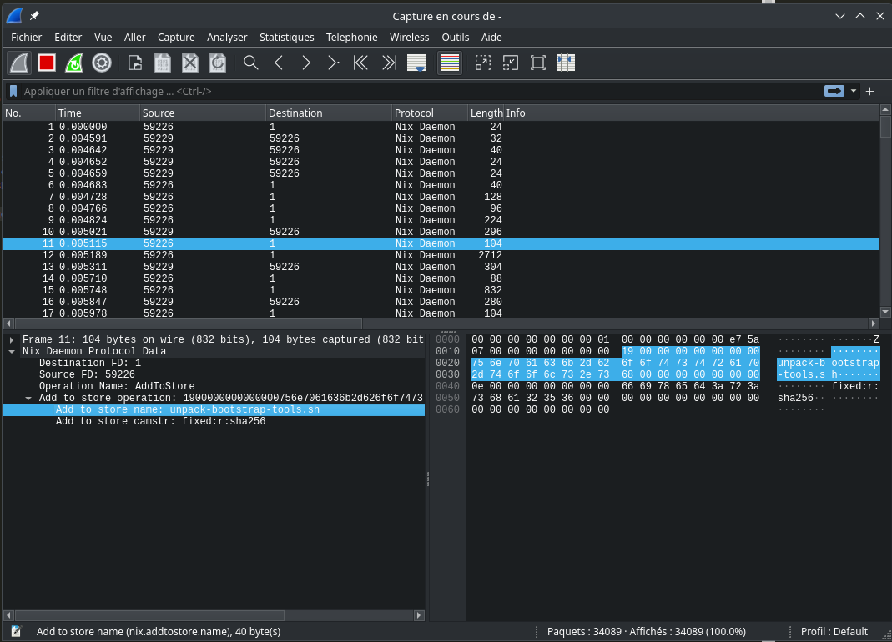

# Nix Daemon Wireshark Dissector

Wireshark lua dissector for the Nix daemon Unix domain socket. A useful tool to debug the Nix daemon protocol.



## Usage

With flakes:

```bash
nix run .#
```

Without flakes:

```bash
"$(nix-build)/bin/snoop-nix-daemon"
```

A Wireshark window appears and start to dissect the packets passing through `/nix/var/nix/daemon-socket/socket`, the Nix daemon socket.

## Background

Wireshark cannot listen to Unix domain sockets out of the box. We leverage the [sockdump](https://github.com/mechpen/sockdump/tree/master) tool to capture the daemon packets before sending them to Wireshark's stdin. Under the hood, sockdump uses BPF (through BCC) to intercept the Unix socket packets. We need the root privilege to load this BPF program to the kernel.

In this repository, you can also find a Lua wireshark dissector in charge of parsing the Nix daemon protocol.
